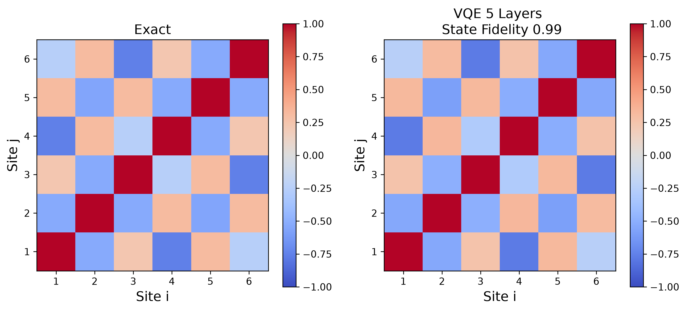
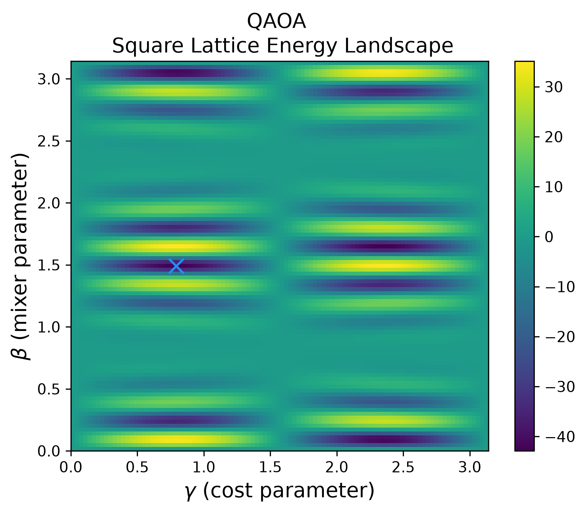

# Hamlet Quantum

## A First-Principles Quantum Computing and Many-Body Simulation Framework


A modular quantum computing many-body simulation framework built from scratch in Python using **NumPy** and **SciPy**, combining quantum circuit simulation, Hamiltonian-based quantum dynamics, variational algorithms, and condensed matter physics simulations into a unified software architecture.

---


# Overview

    

Unlike high-level quantum SDK wrappers, this framework implements core simulation methods directly, emphasizing numerical transparency, modular design, and understanding of the underlying physics. The framework was developed from first principles to provide transparency into the underlying mathematics and numerical methods behind quantum simulation, and is designed as both a research and educational platform for exploring the connection between quantum information, computational physics, and quantum many-body systems.

---

# Highlights

- Custom statevector quantum circuit simulator
- Gate-level quantum operations implemented from first principles
- Circuit compilation, layering, and visualization
- General Pauli-string Hamiltonian representation
- Exact Hamiltonian time evolution
- Suzuki-Trotter digital quantum simulation
- Quantum lattice model generation
- Jordan-Wigner fermion-to-qubit mapping for the Hubbard model
- Observable calculation and correlation analysis
- Variational Quantum Eigensolver (VQE)
- Quantum Approximate Optimization Algorithm (QAOA)

## Structure

The framework separates:

```
Lattice Geometry
        |
        v
Hamiltonian Construction
        |
        v
Quantum Evolution
        |
        v
Observables and Analysis
```

This allows the same underlying infrastructure to support both:

- **gate-based quantum computation**
- **many-body Hamiltonian simulation**

## Demonstrations

### 1. Exact vs Trotter Evolution: Transverse Field Ising Model

The transverse field Ising model:

$$
H =
-J\sum_{\langle i,j\rangle} Z_iZ_j
-h\sum_i X_i
$$

is generated on arbitrary lattice geometries and evolved using both exact and Trotterized methods.

Example workflow:

```python
bonds = square_lattice(
    Nx=3,
    Ny=2
)

H = transverse_ising_hamiltonian(
    bonds,
    J=1,
    h=1
)

t, mz_exact = observable_vs_time(
    circuit,
    H,
    time=15,
    timesteps=100,
    method='exact'
)

t, mz_trotter = observable_vs_time(
    circuit,
    H,
    time=15,
    timesteps=100,
    method='trotter',
    trotter_steps=20
)
```


*Comparison of exact and Trotterized magnetization dynamics for the transverse-field Ising model, illustrating increasing accuracy of the Trotter approximation with a greater number of Trotter steps.*

This demonstrates:

- lattice Hamiltonian construction
- quantum state evolution
- exact numerical dynamics
- Trotter approximation benchmarking
- observable tracking

---

### 2. VQE: Heisenberg Correlation Analysis

The framework implements VQE for approximating ground-state energies using parameterized quantum circuits.

The optimization target is:

$$
E(\theta)=
\langle\psi(\theta)|H|\psi(\theta)\rangle
$$

Example workflow:

```python
result = run_vqe(
    Hamiltonian=H,
    ansatz=hardware_efficient_ansatz,
    optimizer='L-BFGS-B'
)
```




*Exact and VQE-computed nearest-neighbor spin correlation maps demonstrating accurate approximation of the Heisenberg ground state.*


*Portion of gate-level circuit generated by the VQE algorithm with optimized parameters.*  

The VQE implementation demonstrates:

- parameterized circuit construction
- expectation value evaluation
- classical optimization
- comparison against exact diagonalization
- ground-state fidelity analysis

---

### 3. QAOA: Spin State Optimization

The framework includes an implementation of the **Quantum Approximate Optimization Algorithm (QAOA)** for finding low-energy states of spin Hamiltonians.

QAOA prepares a variational quantum state by alternating between evolution under a problem Hamiltonian and a mixer Hamiltonian:

$$|\psi(\boldsymbol{\gamma},\boldsymbol{\beta})\rangle=
\prod_{k=1}^{p}
e^{-i\beta_k H_M}
e^{-i\gamma_k H_C}
\lvert+\rangle^{\otimes n}
$$

where:

- $H_C$ encodes the optimization problem
- $H_M$ mixes the computational basis states
- $p$ is iteration of operations
- $\gamma\$ and $\beta\$ are optimized variational parameters

In this example, spin configurations are encoded as computational basis states and optimized through a Hamiltonian representation of the spin system.

Example workflow:

```python
result = run_qaoa(
    cost_hamiltonian,
    mixer_hamiltonian,
    layers=2,
    optimizer='L-BFGS-B'
)

optimized_state = result.state
energy = result.energy
```

The optimization process minimizes the expectation value:

$$
E(\gamma,\beta)=
\langle\psi(\gamma,\beta)|H_C|\psi(\gamma,\beta)\rangle
$$

and produces a variational approximation to the lowest-energy spin configuration.


*Measurement probabilities after QAOA optimization, showing increasing concentration on the lowest-energy spin state as circuit depth p increases.*



*QAOA energy landscape for p=1, illustrating how the cost and mixer parameters influence the variational energy. The blue marker denotes the optimal parameter pair.*


The notebook demonstrates:

- construction of spin Hamiltonians from physical interactions
- parameterized QAOA circuit generation
- hybrid quantum-classical optimization
- convergence toward low-energy states
- comparison between variational results and exact solutions

---


# Design Philosophy

The project emphasizes:

## First-Principles Implementation

Core algorithms are implemented directly rather than relying on existing quantum frameworks.

This provides:

- Transparency
- Mathematical understanding
- Full control over numerical methods

---

## Physics-Informed Simulation

Rather than treating circuits as abstract operations, Hamlet Quantum connects quantum algorithms to physically meaningful systems:

- Spin models
- Fermionic lattice models
- Quantum dynamics
- Many-body correlations

---

## Modular Scientific Software

The framework separates:

- circuit construction
- Hamiltonian generation
- evolution algorithms
- observables
- visualization

allowing components to be reused across different physical systems.

---

# Suggested Architecture

The project is organized as a reusable Python package:

```
hamlet/
│
├── circuits/
│   ├── circuit.py
│   ├── gates.py
│   └── compiler.py
│
├── hamiltonians/
│   ├── pauli.py
│   ├── hubbard.py
│   ├── ising.py
│   └── heisenberg.py
│
├── algorithms/
│   ├── vqe.py
│   └── qaoa.py
│
├── evolution/
│   └── time_evolution.py
│
├── observables/
│   └── measurements.py
│
└── visualization/
    └── plotting.py
```

This modular architecture separates physical models from simulation algorithms, allowing the same Hamiltonian framework to be used for exact evolution, Trotterized dynamics, VQE, and QAOA.

---

# Limitations

This project focuses on clarity and extensibility rather than competing with optimized production simulators.

Current limitations:

- statevector simulation scales exponentially with qubit number
- dense matrix methods become expensive for larger systems
- no GPU acceleration
- no tensor-network compression
- limited sparse-matrix support

These limitations motivate future extensions toward larger-scale simulation methods.

# Future Development

Planned improvements include:

- Sparse Hamiltonian representations
- Improved simulation scaling
- Tensor-network methods
- Additional lattice geometries 
- Quantum chemistry Hamiltonians
- Added quantum algorithms
- Hardware backend integration

---


# Installation

Clone the repository:

```bash
git clone https://github.com/USERNAME/hamlet-quantum.git
cd hamlet-quantum
```

Install using:

```bash
pip install -e .
```

Run examples:

```bash
jupyter lab examples/
```

---

# Dependencies

Core dependencies:

- Python
- NumPy
- SciPy
- Matplotlib

Development:

- pytest
- Jupyter

---

# Motivation

Modern quantum computing requires expertise across multiple domains:

- Quantum information
- Numerical simulation
- Many-body physics
- Software engineering

Hamlet Quantum was developed to explore these connections by building the computational tools required to understand quantum systems from the ground up.

---

# Author

Brendan Stork

Physics MS — San Jose State University

Research interests:

- Quantum computing
- Quantum simulation
- Condensed matter physics
- Scientific computing
