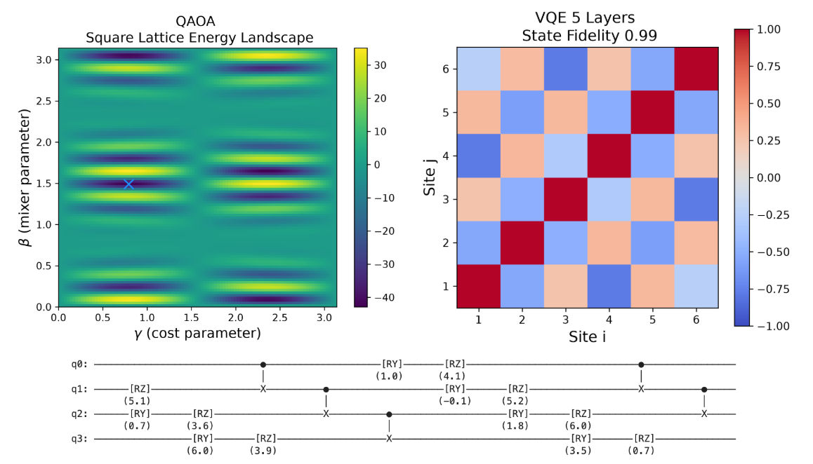
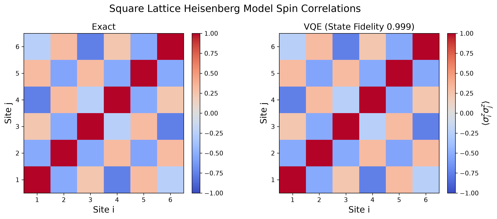
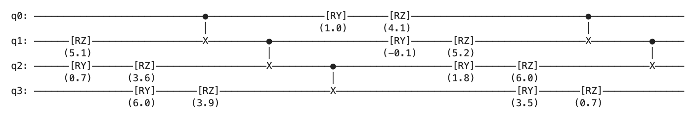
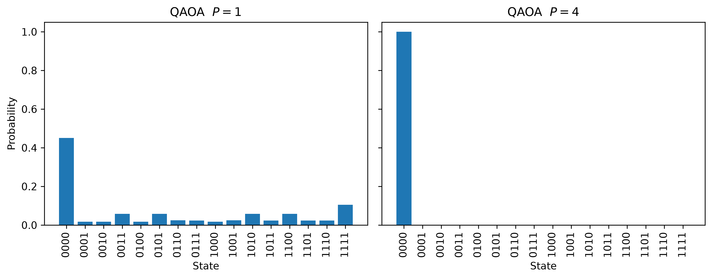
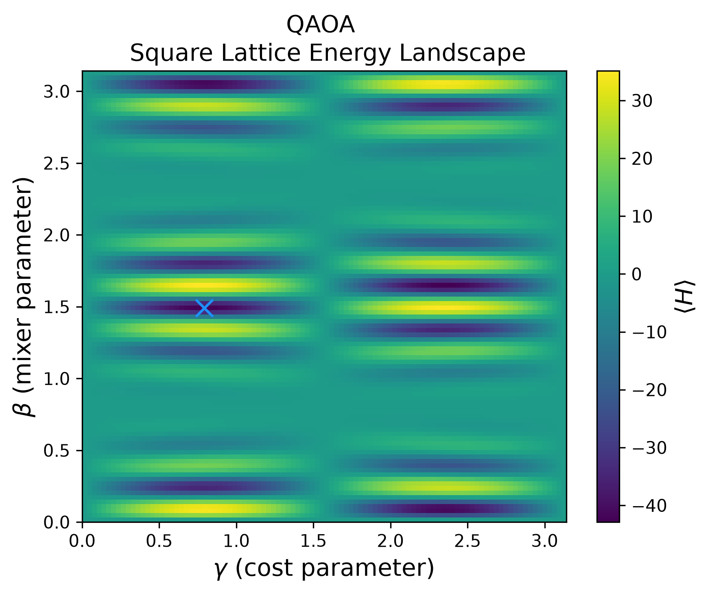

# Hamlet Quantum

## A First-Principles Quantum Computing and Many-Body Simulation Framework


A modular quantum computing and many-body simulation framework built from scratch in Python using NumPy and SciPy. Hamlet Quantum demonstrates an end-to-end workflow for modeling physical systems with quantum computation: from constructing physical Hamiltonians and expressing them in qubit operators, through Hamiltonian evolution and variational algorithms, to gate-level quantum circuits and physical observables.

---



# Overview

Hamlet Quantum connects many-body physics, quantum information, and quantum computation through a unified software architecture.
The framework allows a physical system to be modeled from the ground up.

Core capabilities include:

- Physical-to-quantum circuit workflow
- Quantum lattice model generation
- Custom statevector quantum circuit simulation
- General Pauli-string Hamiltonian representation
- Gate-level quantum operations implemented from first principles
- Jordan-Wigner fermion-to-qubit mapping for the Hubbard model
- Exact Hamiltonian time evolution
- Suzuki-Trotter digital quantum simulation
- Circuit compilation, layering, visualization, and resource analysis
- Observable and correlation calculation
- Variational Quantum Eigensolver (VQE)
- Quantum Approximate Optimization Algorithm (QAOA)

Currently supported lattice models include the Fermi-Hubbard, Heisenberg, and Transverse-Field Ising models.

Rather than delegating core simulation methods to an external black box quantum-computing framework, Hamlet implements the underlying numerical operations directly using NumPy and SciPy, to emphasize numerical transparency, modularity, and understanding of the mathematical connection between physical models and quantum circuits.

---

# End-to-End Quantum Modeling

Hamlet is designed to demonstrate how a the analysis and evolution of a physical system can be translated into an implementable quantum computation.

```text
             Lattice Geometry
                    |
                    v
              Physical Model
                    |
                    v
               Hamiltonian
                    |
                    v
        Pauli-String Representation
                    |
                    v
       Quantum Evolution / Algorithm
                    |
                    v
        Gate-Level Quantum Circuit
                    |
                    v
      Physical Observables / Analysis
```

This architecture allows the same underlying Hamiltonian and circuit infrastructure to support both:

* Gate-based quantum computation
* Many-body Hamiltonian simulation

This demonstrates the connection between a **physical model, its mathematical Hamiltonian, its qubit mapping, and the quantum gate operations required to study it**.

# Demonstrations

## 1. Exact vs Trotter Evolution: Transverse Field Ising Model

The transverse field Ising model:

$$
H =
-J\sum_{\langle i,j\rangle} Z_iZ_j
-h\sum_i X_i
$$

is generated on arbitrary lattice geometries and evolved using both exact and Trotterized methods.

Example workflow:

```python
bonds = square_lattice(
    Nx=3,
    Ny=2
)

H = transverse_ising_hamiltonian(
    bonds,
    J=1.0,
    h=1.0,
)

mZ = magnetization(axis = 'Z')

t, mz_exact = observable_vs_time(
    circuit,
    H,
    time=15,
    timesteps=100,
    method='exact',
    observable = mZ
)

t, mz_trotter = observable_vs_time(
    circuit,
    H,
    time=15,
    timesteps=100,
    method='trotter_fixed_steps',
    trotter_steps=20,
    observable = mZ
)
```


*Comparison of exact and Trotterized magnetization dynamics for the transverse-field Ising model, illustrating increasing accuracy of the Trotter approximation with a greater number of Trotter steps.*

This demonstrates:

- lattice Hamiltonian construction
- quantum state evolution
- exact numerical dynamics
- Trotter approximation benchmarking
- observable tracking

---

## 2. VQE: Heisenberg Correlation Analysis

The framework implements VQE for approximating ground-state energies using parameterized quantum circuits.

The optimization target is:

$$
E(\theta)=
\langle\psi(\theta)|H|\psi(\theta)\rangle
$$

Example workflow:

```python

H = heisenberg_hamiltonian(
    bonds, 
    Jx=-1, 
    Jy=-1, 
    Jz=-1, 
    h=0
)

layers = 5

vqe_results = run_vqe(
    H, 
    ansatz=hardware_efficient_ansatz, 
    method='L-BFGS-B', 
    layers=layers
)

vqe_ground_energy = vqe_results.fun
optimal_params = vqe_results.x

psi = Quantum_Circuit(N) 

vqe_ground_state = hardware_efficient_ansatz(
    psi, 
    optimal_params, 
    layers=layers
)

vqe_ground_state.draw()

```



*Exact and VQE-computed nearest-neighbor spin correlation maps demonstrating accurate approximation of the Heisenberg ground state.*



*Portion of gate-level circuit generated by the VQE algorithm with optimized parameters.*  

The VQE implementation demonstrates:

- parameterized circuit construction
- expectation value evaluation
- classical optimization
- comparison against exact diagonalization
- ground-state fidelity analysis

---

## 3. QAOA: Spin State Optimization

The framework includes an implementation of the **Quantum Approximate Optimization Algorithm (QAOA)** for finding low-energy states of spin Hamiltonians.

QAOA prepares a variational quantum state by alternating between evolution under a problem Hamiltonian and a mixer Hamiltonian:

$$|\psi(\boldsymbol{\gamma},\boldsymbol{\beta})\rangle=
\prod_{k=1}^{p}
e^{-i\beta_k H_M}
e^{-i\gamma_k H_C}
\lvert+\rangle^{\otimes n}
$$

where:

- $H_C$ encodes the optimization problem
- $H_M$ mixes the computational basis states
- $p$ is the number of QAOA layers
- $\gamma\$ and $\beta\$ are optimized variational parameters

In this example, spin configurations are encoded as computational basis states and optimized through a Hamiltonian representation of the spin system.

Example workflow:

```python

cost_H = ising_hamiltonian(
    bonds, 
    J = 1, 
    h = 10, 
    axis='Z')

p = 2

qaoa_results = run_qaoa(
    cost_H,
    p=p,
    optimizer='COBYLA'
)

optimal_parameters = qaoa_results['parameters']
qaoa_energy_value = qaoa_results['cost']
qaoa_state = qaoa_results['state']

p_depth_probabilities = p_val_probability(cost_H, 4)

gammas = np.linspace(0, np.pi, 100)
betas = np.linspace(0, np.pi, 100)
E_map = qaoa_energy_map(
    cost_H,
    gammas = gammas,
    betas = betas
)
```

The optimization process minimizes the expectation value:

$$
E(\gamma,\beta)=
\langle\psi(\gamma,\beta)|H_C|\psi(\gamma,\beta)\rangle
$$

and produces a variational approximation to the lowest-energy spin configuration.



*Measurement probabilities after QAOA optimization, showing increasing concentration on the lowest-energy spin state as the number of QAOA layers p increases.*



*QAOA energy landscape for p=1, illustrating how the cost and mixer parameters influence the variational approximation for energy. The blue marker denotes the optimal parameter pair.*

The notebook demonstrates:

- construction of spin Hamiltonians from physical interactions
- parameterized QAOA circuit generation
- hybrid quantum-classical optimization
- convergence toward low-energy states
- comparison between variational results and exact solutions

---

# Physics Validation

The lattice models and quantum algorithms are validated against known physical and numerical results.

Validation methods include:

* Exact diagonalization
* Comparison of exact and Trotterized dynamics
* Trotter convergence with increasing step count
* VQE energy comparison against exact ground-state energies
* Ground-state fidelity and correlation comparisons

The goal is to verify not only that the software executes correctly, but that the implemented models reproduce the expected physics.

---

# Design Philosophy

The project emphasizes:

## First-Principles Implementation

Core algorithms are implemented directly rather than relying on existing external quantum frameworks.

This provides:

- Transparency
- Mathematical understanding
- Full control over numerical methods

---

## Physics-Informed Simulation

Rather than treating circuits as abstract operations, Hamlet Quantum connects quantum algorithms to physically meaningful systems:

- Spin models
- Fermionic lattice models
- Quantum dynamics
- Many-body correlations

---

## Modular Scientific Software

The framework separates:

- Lattice and model construction
- Hamiltonian generation
- Pauli-string representation
- Circuit construction
- Evolution algorithms
- Observables
- Visualization and analysis

This allows the same computational infrastructure to be reused across different physical systems and quantum algorithms

---

# Limitations

This project focuses on clarity and extensibility rather than competing with optimized production simulators.

Current limitations:

- statevector simulation scales exponentially with qubit number
- dense matrix methods become expensive for larger systems
- no GPU acceleration
- no tensor-network compression
- limited sparse-matrix support

These limitations motivate future extensions toward larger-scale simulation methods.

# Future Development

Planned improvements include:

- Sparse Hamiltonian representations
- Improved simulation scaling
- Tensor-network methods
- Additional lattice geometries 
- Quantum chemistry Hamiltonians
- Added quantum algorithms
- Hardware backend integration

---

## Installation

Clone the repository:

```bash
git clone https://github.com/BrendanStork/Hamlet-Quantum.git
cd Hamlet-Quantum
```

Create the environment and install dependencies with **uv**:

```bash
uv sync
```

Alternatively, install the package in editable mode with pip:

```bash
pip install -e .
```

Launch the demonstration notebooks:

```bash
jupyter lab notebooks/
```

---

# Dependencies

Core dependencies:

- Python
- NumPy
- SciPy
- Matplotlib

Development:

- pytest
- Jupyter

---

# License

Hamlet Quantum is licensed under the [MIT License](LICENSE).

---

# Author

Brendan Stork

Physics MS — San Jose State University

Research interests:

- Quantum computing
- Quantum simulation
- Condensed matter physics
- Scientific computing
